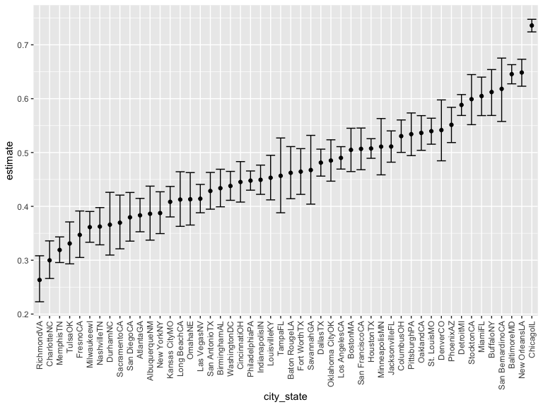
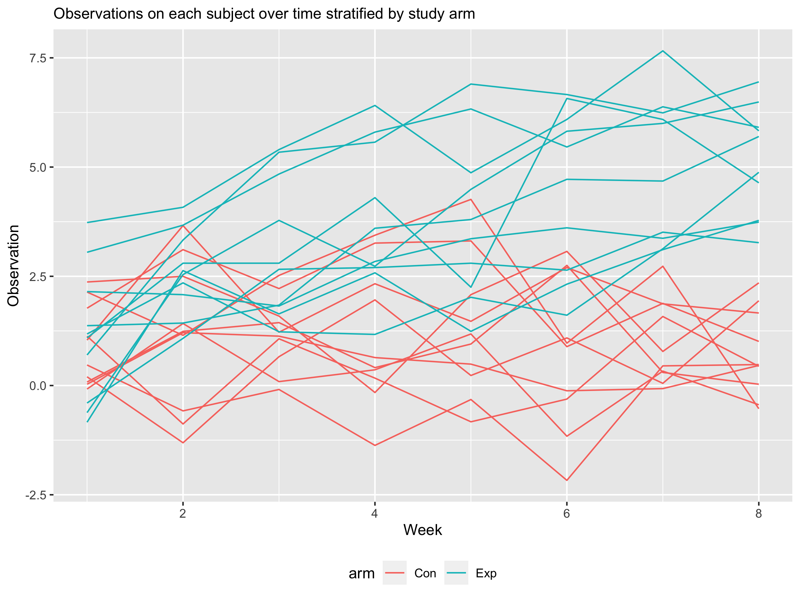

p8105\_hw5\_hw2849
================
Haotian Wu
11/15/2021

## Problem 1

``` r
homicide_df = 
  read_csv("./homicide-data.csv", na = c("", "Unknown")) %>% 
  mutate(
    city_state = str_c(city, state),
    resolution = case_when(
      disposition == "Closed without arrest" ~ "unsolved",
      disposition == "Open/No arrest" ~ "unsolved",
      disposition == "Closed by arrest" ~ "solved"
    )) %>% 
  relocate(city_state) %>% 
  filter(city_state != "TulsaAL")
```

Let’s focus on Baltimore, MD.

``` r
baltimore_df = 
  homicide_df %>% 
  filter(city_state == "BaltimoreMD")
  
baltimore_summary = 
  baltimore_df %>% 
  summarize(
    unsolved = sum(resolution == "unsolved"), ## number of unsolved
    n = n() ## total number of homicide
  )

baltimore_test = 
  prop.test(x = baltimore_summary %>% pull(unsolved), 
            n = baltimore_summary %>% pull(n))

baltimore_test %>% 
  broom::tidy()
```

    ## # A tibble: 1 × 8
    ##   estimate statistic  p.value parameter conf.low conf.high method    alternative
    ##      <dbl>     <dbl>    <dbl>     <int>    <dbl>     <dbl> <chr>     <chr>      
    ## 1    0.646      239. 6.46e-54         1    0.628     0.663 1-sample… two.sided

Let’s try to iterate across cities!

First off, write a function

``` r
prop_test_function = function(city_df){
  
  city_summary = 
    city_df %>% 
    summarize(
      unsolved = sum(resolution == "unsolved"), 
      n = n() 
    )
  
  city_test = 
    prop.test(x = city_summary %>% pull(unsolved), 
              n = city_summary %>% pull(n))
  
  return(city_test)
  
}

prop_test_function(baltimore_df)
```

    ## 
    ##  1-sample proportions test with continuity correction
    ## 
    ## data:  city_summary %>% pull(unsolved) out of city_summary %>% pull(n), null probability 0.5
    ## X-squared = 239.01, df = 1, p-value < 2.2e-16
    ## alternative hypothesis: true p is not equal to 0.5
    ## 95 percent confidence interval:
    ##  0.6275625 0.6631599
    ## sample estimates:
    ##         p 
    ## 0.6455607

``` r
homicide_df %>% 
  filter(city_state == "AlbuquerqueNM") %>% 
  prop_test_function()
```

    ## 
    ##  1-sample proportions test with continuity correction
    ## 
    ## data:  city_summary %>% pull(unsolved) out of city_summary %>% pull(n), null probability 0.5
    ## X-squared = 19.114, df = 1, p-value = 1.232e-05
    ## alternative hypothesis: true p is not equal to 0.5
    ## 95 percent confidence interval:
    ##  0.3372604 0.4375766
    ## sample estimates:
    ##         p 
    ## 0.3862434

Now, let’s iterate across all cities

``` r
results_df = 
  homicide_df %>% 
  nest(data = uid:resolution) %>% 
  mutate(
    test_results = map(data, prop_test_function),
    tidy_results = map(test_results, broom::tidy)
  ) %>% 
  select(city_state, tidy_results) %>% 
  unnest(tidy_results) %>% 
  select(city_state, estimate, starts_with("conf"))
```

Try to make a plot showing estimates and confidence intervals

``` r
results_df %>% 
  mutate(city_state = fct_reorder(city_state, estimate)) %>% 
  ggplot(aes(x = city_state, y = estimate)) + 
  geom_point() + 
  geom_errorbar(aes(ymin = conf.low, ymax = conf.high)) + 
  theme(axis.text.x = element_text(angle = 90, vjust = 0.5, hjust = 1))
```



``` r
## another approach by map2

homicide_df %>% 
  group_by(city_state) %>% 
  summarize(
    unsolved = sum(resolution == "unsolved"),
    n = n()
  ) %>% 
  mutate(
    test_results = map2(unsolved, n, prop.test),
    tidy_results = map(test_results, broom::tidy)
  ) %>% 
  select(city_state, tidy_results) %>% 
  unnest(tidy_results) %>% 
  select(city_state, estimate, starts_with("conf"))
```

    ## # A tibble: 50 × 4
    ##    city_state    estimate conf.low conf.high
    ##    <chr>            <dbl>    <dbl>     <dbl>
    ##  1 AlbuquerqueNM    0.386    0.337     0.438
    ##  2 AtlantaGA        0.383    0.353     0.415
    ##  3 BaltimoreMD      0.646    0.628     0.663
    ##  4 Baton RougeLA    0.462    0.414     0.511
    ##  5 BirminghamAL     0.434    0.399     0.469
    ##  6 BostonMA         0.505    0.465     0.545
    ##  7 BuffaloNY        0.612    0.569     0.654
    ##  8 CharlotteNC      0.300    0.266     0.336
    ##  9 ChicagoIL        0.736    0.724     0.747
    ## 10 CincinnatiOH     0.445    0.408     0.483
    ## # … with 40 more rows

## Problem 2

``` r
files = list.files("./data/", full.names = TRUE) %>% ## import files with relative path
  map(read_csv) ## iterate over file names

for (i in 1:20) { ## separate control and experiment
  if (i < 11) { ## add study id and arm con
    files[[i]] <- files[[i]] %>% 
      mutate(arm = "Con", 
             study_id = i)
  } else if (i > 10) { ## add arm exp
    files[[i]] <- files[[i]] %>% 
      mutate(arm = "Exp", 
             study_id = i - 10)
  }
}

final_df = files %>% 
  bind_rows() %>% 
  pivot_longer( ## make a readable table
    week_1:week_8,
    names_to = "week",
    values_to = "obs_value"
  ) %>% 
  mutate( ## tidy week and study_id variable
   week = str_remove(week, "week_"),
   week = as.numeric(week),
   study_id = as.character(study_id)
  ) %>% 
  arrange(week, study_id) 
```

First, using `list.files` to import the list of files and file names,
then using `map` to read all .csv files with relative path, and saved to
`files`. Next, writing a function to separate the control and
experiment, and adding `study_id` for each subject. Lastly, stack each
subject into one data frame `final_df` and tidy the data.

Now, make a spaghetti plot showing trends on observations for each
subject over time.

``` r
final_df %>% 
  group_by(arm, study_id) %>% 
  ggplot(aes(x = week, y = obs_value, color = arm, type = study_id)) + 
  geom_line() + 
  labs(
    title = "Observations on each subject over time stratified by study arm",
    x = "Week", 
    y = "Observation") + 
  theme(
    legend.position = "bottom", 
    plot.title = element_text(size = 11))
```



From the spaghetti plot, we observed that generally participants
assigned to `exp` group have a higher value than those who assigned to
`con` group over time. In addition, `exp` group shows an increasing
trend while `con` group remain constant across the study period.

## Problem 3

``` r
set.seed(10)

iris_with_missing = iris %>% 
  map_df(~replace(.x, sample(1:150, 20), NA)) %>%
  mutate(Species = as.character(Species))
```
